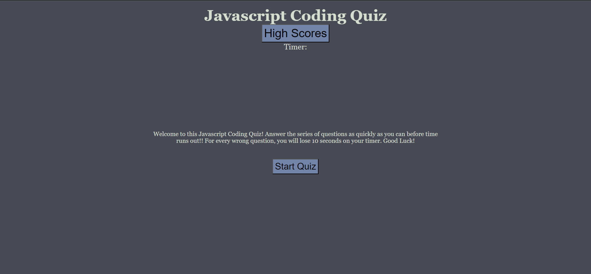
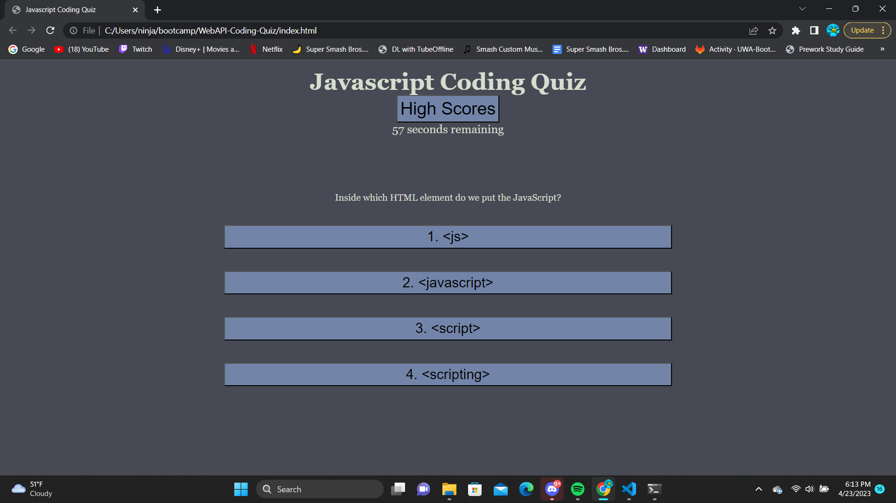
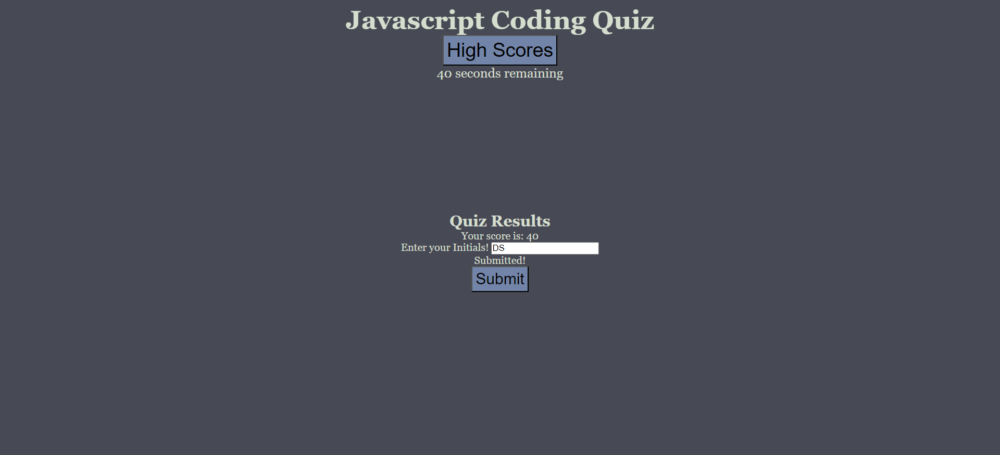

# WebAPI-Coding-Quiz

## Description

This project is a Javascript quiz, made using Javascript!

## Usage 

Press the start button to begin the quiz. You will have 60 seconds to answer the questions on the quiz, with the goal being to finish the quiz with as much time remaining as possible!. Answering a question wrong will result in a 10 second time deduction. Once you finish the quiz, you can enter your initials to upload it to the high score page!

[Javascript Quiz Link](https://dksolomon.github.io/WebAPI-Coding-Quiz/)
